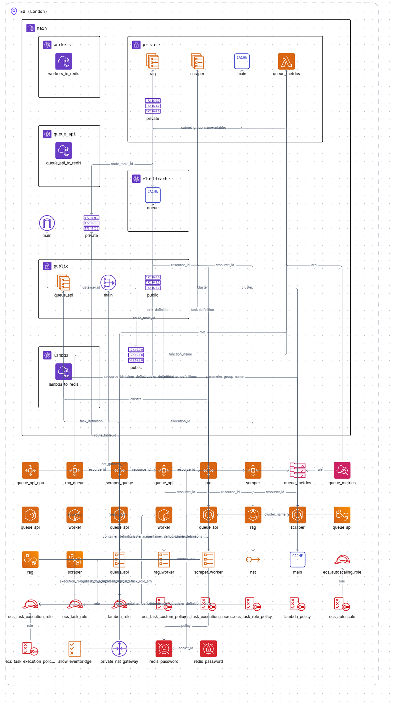

## Distributed Web Crawler & Rag Pipeline

Here is the code for my distributed web crawler rag pipeline.
It features a worker framework I've designed to be easily extendable to cater to **any** task involving worker nodes which communicate via queues.

## Tech Stack:

- Go
- Typescript
- Terraform
- Redis
- AWS

## Features:

- Distributed scraper and RAG clusters communicate via Redis queues.
- Localized text processing, chunking and embedding inference (secure).
- Autoscaling of clusters using custom Redis queue size metrics (refreshed by Lambda every minute).
- Email addresses, phone numbers and links extracted from web pages.
- Very high test coverage

## Infrastructure Visualized

